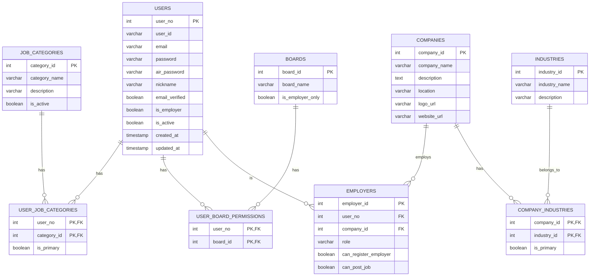

```mermaid
erDiagram
    USERS ||--o{ USER_JOB_CATEGORIES : has
    USERS ||--o{ USER_BOARD_PERMISSIONS : has
    USERS ||--o{ EMPLOYERS : is

    JOB_CATEGORIES ||--o{ USER_JOB_CATEGORIES : has

    COMPANIES ||--o{ EMPLOYERS : employs
    COMPANIES ||--o{ COMPANY_INDUSTRIES : has

    INDUSTRIES ||--o{ COMPANY_INDUSTRIES : belongs_to

    BOARDS ||--o{ USER_BOARD_PERMISSIONS : has

    USERS {
        int user_no PK
        varchar user_id
        varchar email
        varchar password
        varchar air_password
        varchar nickname
        boolean email_verified
        boolean is_employer
        boolean is_active
        timestamp created_at
        timestamp updated_at
    }

    JOB_CATEGORIES {
        int category_id PK
        varchar category_name
        varchar description
        boolean is_active
    }

    USER_JOB_CATEGORIES {
        int user_no PK,FK
        int category_id PK,FK
        boolean is_primary
    }

    COMPANIES {
        int company_id PK
        varchar company_name
        text description
        varchar location
        varchar logo_url
        varchar website_url
    }

    EMPLOYERS {
        int employer_id PK
        int user_no FK
        int company_id FK
        varchar role
        boolean can_register_employer
        boolean can_post_job
    }

    INDUSTRIES {
        int industry_id PK
        varchar industry_name
        varchar description
    }

    COMPANY_INDUSTRIES {
        int company_id PK,FK
        int industry_id PK,FK
        boolean is_primary
    }

    BOARDS {
        int board_id PK
        varchar board_name
        boolean is_employer_only
    }

    USER_BOARD_PERMISSIONS {
        int user_no PK,FK
        int board_id PK,FK
    }
```